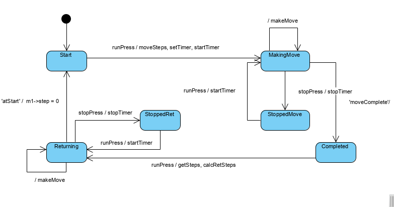

# Stepper Motor Control

This project was created using KeilMicroVision's software on the KL25Z freedom development board.

The pit ISR has been used to move the motor to the next step with updateMotor().
The pit load value has been calculated using the time and the steps needed for the full movement.
Before the movement the steps are loaded with the moveSteps() function.
The timer is stopped to pause the motion.

The project has a two button and a motor. The behavior is as follows:
1. Pressing the run button causes the motor to rotate the amount, direction and speed based on the table specified in the lab 7 sheet
2. Pressing the stop button will pause any movement .
3. Once the movement has finished, pressing the run button again will cause the motor to return to the starting position. 
The motor will take the shortest route at the same speed that it was previously moving at.
4. If the run button is pressed again, the motor will execute the next movement.

State Machine

